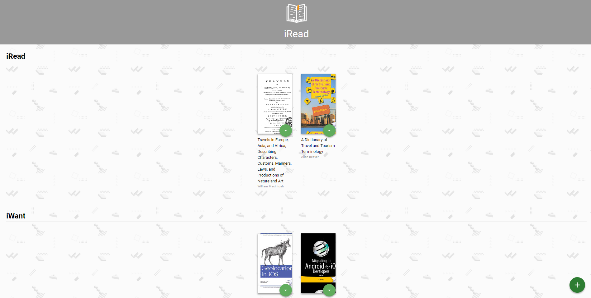
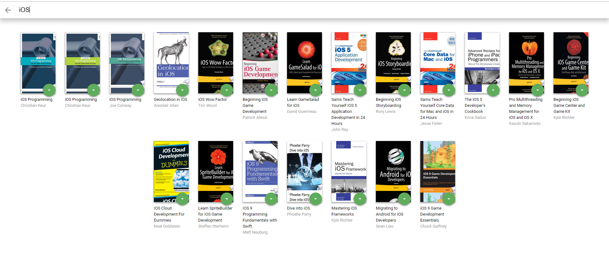
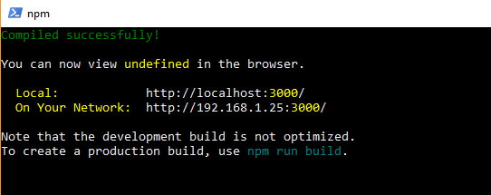

# MyReads Project

MyReads is an Application written in the Frontend Webdevelopment branch of the Udacity Nanodegree Courses. It's focus is on using REACT to create a flexible usability whilst maintaining a good quality Website. It is used to track the books I want to read, books I have read, and books I am reading in the moment. Furthermore is it possible to find new books and add them to the so called 'bookshelf'





## Getting Started

These instructions will get you a copy of the project up and running on your local machine for development and testing purposes. See deployment for notes on how to deploy the project on a live system.

### Prerequisites

Before you get started, make sure you have create-react-app installed. It is not essential, but is a practical tool to start your own react-app! If it is not installed yet, then enter that command in the cmd-window:

```
$ npm install -g create-react-app
```

And make sure you have create-react-app as a system variable in your **PATH**.

### Installing

A step by step series of examples that tell you how to get a development env running

1. Clone this repository
2. Cd into it
3. Install all modules by using

```
$ npm install
```
4. Start the server by simply writing

```
$ npm start
```
The command window should look like this then:




## Commands for the backend-server

* [`getAll`](#getall)
* [`update`](#update)
* [`search`](#search)

### `getAll`

Method Signature:

```js
getAll()
```

* Returns a Promise which resolves to a JSON object containing a collection of book objects.
* This collection represents the books currently in the bookshelves in your app.

### `update`

Method Signature:

```js
update(book, shelf)
```

* book: `<Object>` containing at minimum an `id` attribute
* shelf: `<String>` contains one of ["wantToRead", "currentlyReading", "read"]  
* Returns a Promise which resolves to a JSON object containing the response data of the POST request

### `search`

Method Signature:

```js
search(query)
```

* query: `<String>`
* Returns a Promise which resolves to a JSON object containing a collection of a maximum of 20 book objects.
* These books do not know which shelf they are on. They are raw results only. You'll need to make sure that books have the correct state while on the search page.

## Important
The backend API uses a fixed set of cached search results and is limited to a particular set of search terms, which can be found in [SEARCH_TERMS.md](SEARCH_TERMS.md). That list of terms are the _only_ terms that will work with the backend, so don't be surprised if your searches for Basket Weaving or Bubble Wrap don't come back with any results.

## Deployment

If you want to create a deployment build, simply write

```
$ npm run build
```

## Authors

* **Udacity** - *Initial work* - [Udacity-Repo](https://github.com/udacity/reactnd-project-myreads-starter)


## Acknowledgments

* Hat tip to everyone, that did the same project
* Thanks to Udacity to make this all possible
* Special thanks to my coffee machine, that keeps me alive throughout coding nights
